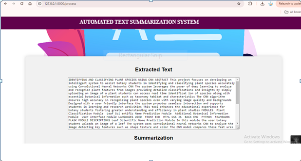
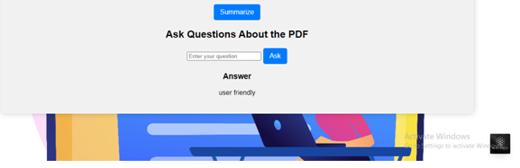

# 🧠 Automated Text Summarization System

An intelligent web application built using **Flask** that allows users to:
- 📄 Upload a PDF
- 🔍 Extract and summarize text content
- ❓ Ask questions about the document using an interactive chatbot

---

## 🚀 Features

- 📁 PDF Upload and Parsing
- ✂️ Automatic Text Extraction
- 📝 Abstractive & Extractive Summarization
- 🤖 Question-Answering on Uploaded PDFs
- 💬 LLM-powered chatbot using LLaMA or similar
- 🧼 Custom Text Preprocessing & Cleaning
- 🎨 Responsive UI with static assets

---

## 📸 Screenshots

### Extracted Text View

### Ask Questions About PDF

---

## 🛠️ Tech Stack

| Component         | Technology                  |
|------------------|-----------------------------|
| Backend          | Python, Flask               |
| Summarization    | Transformers / Custom Logic |
| QA Model         | LLaMA or Similar LLMs       |
| PDF Processing   | PyMuPDF / PDFMiner          |
| Frontend         | HTML, CSS, JS (basic)       |
 

---

## 📂 Project Structure
Summarizer/
├── app.py # Flask main app
├── summarizer.py # Text summarization logic
├── pdf_extractor.py # PDF parsing code
├── llama_qa.py # QA model integration
├── QA_chatbot.py # User question handling
├── templates/ # HTML templates
├── static/ # Assets & Images
└── screenshots/ # Project UI screenshots

---

✍️ Author
Gnanaseelan M
🎓 BSc Computer Technology Graduate – Class of 2025
🚀 Quick learner with strong communication, leadership, and adaptability
🔧 Skilled in Python, Java, Flask, HTML/CSS, and SQL
🎯 Passionate about real-world problem solving using tech

📫 Contact:

🔗 Portfolio Website

💼 LinkedIn

🧠 GitHub

📧 gnanaseelan145@gmail.com

📱 +91 63806 93689
